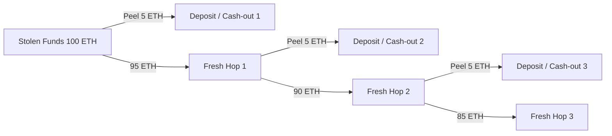
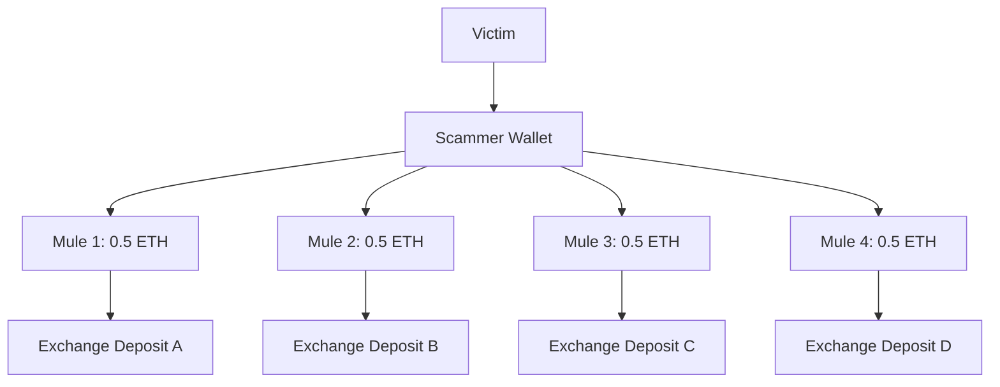

# Module 1: First-Principles & Root-Cause Analysis of Crypto Fraud Tracing

## 1. The Physics and Mathematics of Blockchains

To solve cryptocurrency fraud tracing at a research level, we must start from the mathematical definition of a blockchain rather than treating it as just "data in a database."

A blockchain is fundamentally a **replicated deterministic finite state machine**:
$$\mathcal{S}_{t+1} = \Upsilon(\mathcal{S}_t, \mathcal{T}_t)$$

Where:
- $\mathcal{S}_t$ is the global ledger state at block height $t$.
- $\mathcal{T}_t = \{tx_1, tx_2, \dots, tx_k\}$ is the set of strictly ordered, valid transactions included in block $t$.
- $\Upsilon$ is the state transition function.

Every transaction represents a directed transfer of value and state:
$$tx = \langle \text{sender}, \text{receiver}, v, t_{stamp}, \dots \rangle$$

---

## 2. The Root-Cause Dilemma: The Fungibility & Mixing Paradox

Why is crypto fraud tracing easy in theory, but intractable in naive implementations?

### A. The Two Blockchain State Models
1. **UTXO Model (Bitcoin, Cardano):**
   - Value exists in discrete, indivisible packets called Unspent Transaction Outputs (UTXOs).
   - Each transaction consumes explicit inputs and produces explicit outputs:
     $$\sum \text{Inputs} = \sum \text{Outputs} + \text{Fee}$$
   - *Advantage for tracing:* Direct lineage exists from input to output.

2. **Account-Based Model (Ethereum, TRON, Polygon, Arbitrum):**
   - Balances are continuous scalar values stored in state tree storage: $\text{Balance}(A) \in \mathbb{R}_{\ge 0}$.
   - When account $A$ with balance $B_{clean}$ receives $V_{stolen}$, the balance becomes $B_{total} = B_{clean} + V_{stolen}$.
   - **The Core Paradox:** Once scalar values merge in a single account, **cryptographic fungibility erases the physical identity of the tokens**. If account $A$ then transfers $V_{out} < B_{total}$ to account $B$, *which portion was the stolen funds?*

This is the exact reason naive BFS fails: without a mathematical principle to govern the division of scalar funds, you cannot determine if an outgoing transaction is laundering the stolen money or merely spending unrelated balance.

---

## 3. Graph Theory and the Combinatorial Explosion ($b^d$)

When modeling a blockchain as a directed multigraph $G = (V, E)$:
- **Vertices ($V$):** Distinct wallet addresses / smart contract accounts.
- **Directed Edges ($E$):** Transactions where $e = (u, v, w, \tau)$ represents a transfer from $u$ to $v$ of value $w$ at timestamp $\tau$.

If a fraudster splits stolen money across $b$ child wallets (branching factor), and each of those splits into $b$ wallets over $d$ hops:
$$\text{Total Paths} = \mathcal{O}(b^d)$$

- For a simple transfer: $b = 1 \implies 1^d = 1$ path (trivial).
- For a scammer intentionally obfuscating: $b = 10, d = 4 \implies 10^4 = 10,000$ addresses.
- For high-fanout automated scripts: $b = 50, d = 4 \implies 50^4 = 6,250,000$ addresses.

**Root Cause:** A naive Breadth-First Search (BFS) explores the entire graph uniformly. At $b=50$, rate-limited public APIs will throttle after 50 calls, memory will blow up, and human investigators will face an unreadable hairball graph.

---

## 4. The 3 Canonical Topological Laundering Patterns

Research into real-world cybercrime reveals three dominant structural subgraphs:

### 1. The Peel Chain (Linear High-Volume Stripping)

- **Signature:** A linear backbone where at each step, a small amount is peeled off to an off-ramp or service, and the dominant remainder moves to a brand-new address.

### 2. Smurfing / Structuring (Fan-out Tree)

- **Signature:** Rapid fan-out of sub-threshold transactions (designed to stay below AML alert thresholds like \$10,000 / ₹50,000).

### 3. Co-Mingling / Liquidity Dilution
- The fraudster deposits stolen funds into a decentralized swap pool (Uniswap, 1inch) or a high-velocity transit wallet.
- **Challenge:** The funds mix with legitimate volume, demanding probabilistic taint decay algorithms to prevent false-positive path explosion.
