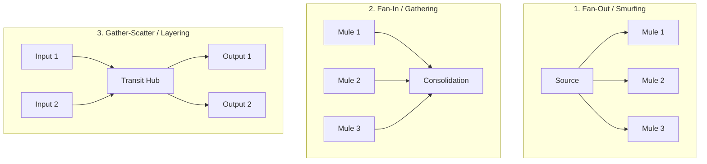

# Literature Deep-Dive: Money Laundering Subgraph Topologies & Elliptic2
**Papers:**  
- *The Shape of Money Laundering: Subgraph Representation Learning on the Blockchain with the Elliptic2 Dataset* (Bellei et al., MIT-IBM Watson AI Lab & Elliptic, 2024, arXiv:2404.19109)  
- *Identifying Money Laundering Subgraphs on the Blockchain* (Song et al., 2024, arXiv:2410.08394)  
- *MPOCryptoML: Multi-Pattern based Off-Chain Crypto Money Laundering Detection* (Samadi et al., 2025, arXiv:2508.12641)

---

## 1. Paradigm Shift: Node Classification vs. Subgraph Topologies

Early machine learning models (like the original 2019 Elliptic benchmark) tried to classify *individual transactions or nodes* as licit or illicit.  
The breakthrough in Bellei et al. (2024) and Song et al. (2024) is that **money laundering cannot be recognized at the node level—it is defined by the SHAPE of the subgraph**.

A single wallet sending 5 ETH looks completely normal. What makes it criminal is its participation in an orchestrated multi-hop motif.

---

## 2. The 5 Canonical Laundering Subgraphs (MPOCryptoML & Elliptic2)

### Mathematical Definitions:
1. **Fan-Out (Structuring / Smurfing):**
   - High out-degree to in-degree ratio: $\frac{d^+(u)}{d^-(u)} \gg 1$.
   - Uniform or near-equal split of values: $\text{StdDev}(w_1, w_2, \dots, w_k) \approx 0$.
   - Tight temporal burst: all outgoing transactions broadcasted within minutes.

2. **Fan-In (Consolidation / Cashing Out):**
   - High in-degree to out-degree ratio: $\frac{d^-(u)}{d^+(u)} \gg 1$.
   - Originates from disparate sender clusters and aggregates into a single high-value deposit.

3. **Gather-Scatter (Concentric transit nodes):**
   - Node acts as a mixing junction. Flow entering matches flow exiting within $\pm 2\%$ (accounting for gas fees) with near-zero holding duration (dwell time $< 30 \text{ minutes}$).

4. **Stack / Linear Chains (Peel / Layering):**
   - Sequential chain of hops with in-degree = 1 and out-degree = 1 (or 2 if peeling).

---

## 3. The RevTrack / RevFilter Pruning Strategy
Song et al. introduced **RevTrack**:
- Instead of computing features on every node, identify the **initial senders** (crime source) and **final receivers** (exchanges/off-ramps).
- Use iterative filtering (**RevFilter**) to eliminate background licit transactions:
  - If a transaction path does not contribute to the flow reaching a sink within the temporal constraints, it is removed from the active subgraph.
- **Result:** Reduces graph complexity by >85% without sacrificing recall on dirty funds.
